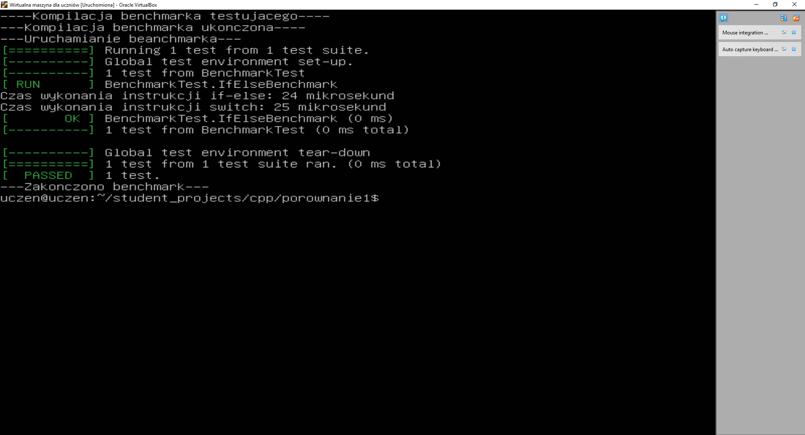

## Benchmark wydajności instrukcji if-else i switch w C++
## Opis
Ten program w języku C++ porównuje wydajność instrukcji if-else i switch, korzystając z frameworka Google Test. Kod mierzy czas wykonania obu konstrukcji dla tej samej liczby iteracji oraz sprawdza, czy wyniki zwracane przez obie funkcje są identyczne. Czas wykonania mierzony jest za pomocą biblioteki chrono w mikrosekundach.

## Kod
~~~~ cpp 
#include <iostream>
#include <chrono>
#include <gtest/gtest.h>

using namespace std;

// Funkcja używająca instrukcji if-else
int compareIf(int value) {
    if (value == 1) {
        return 10;  // Zwraca 10 dla value == 1
    }
    else if (value == 2) {
        return 20;  // Zwraca 20 dla value == 2
    }
    else if (value == 3) {
        return 30;  // Zwraca 30 dla value == 3
    }
    else {
        return 40;  // Zwraca 40 dla każdej innej wartości
    }
}

// Funkcja używająca instrukcji switch
int compareSwitch(int value) {
    switch (value) {
        case 1:
            return 10;  // Zwraca 10 dla value == 1
        case 2:
            return 20;  // Zwraca 20 dla value == 2
        case 3:
            return 30;  // Zwraca 30 dla value == 3
        default:
            return 40;  // Zwraca 40 dla każdej innej wartości
    }
}

// Test porównujący wydajność instrukcji switch i if
TEST(BenchmarkTest, IfElseBenchmark) {
    const int iterations = 10000;
    int sumIf = 0;
    int sumSwitch = 0;

    // Pomiar czasu dla if-else
    auto startIf = std::chrono::high_resolution_clock::now();
    for (int i = 0; i < iterations; i++) {
        sumIf += compareIf(i % 4);  // Wywołanie compareIf z wartościami 0, 1, 2, 3
    }
    auto endIf = std::chrono::high_resolution_clock::now();
    auto durationIf = std::chrono::duration_cast<std::chrono::microseconds>(endIf - startIf);

    // Pomiar czasu dla switch
    auto startSwitch = std::chrono::high_resolution_clock::now();
    for (int i = 0; i < iterations; i++) {
        sumSwitch += compareSwitch(i % 4);  // Wywołanie compareSwitch z wartościami 0, 1, 2, 3
    }
    auto endSwitch = std::chrono::high_resolution_clock::now();
    auto durationSwitch = std::chrono::duration_cast<std::chrono::microseconds>(endSwitch - startSwitch);

    // Wyświetlanie wyników
    cout << "Czas wykonania instrukcji if-else: " << durationIf.count() << " mikrosekund" << endl;
    cout << "Czas wykonania instrukcji switch: " << durationSwitch.count() << " mikrosekund" << endl;

    // Sprawdzanie poprawności wyników
    ASSERT_EQ(sumIf, sumSwitch);  // Suma wyników z if i switch powinna być taka sama
}

int main(int argc, char **argv) {
    ::testing::InitGoogleTest(&argc, argv);
    return RUN_ALL_TESTS();
}
~~~~

## Funkcje
compareIf(int value)

Funkcja korzysta z serii instrukcji if-else, aby zwrócić odpowiednią wartość na podstawie przekazanej liczby value.
Zwraca:

10, gdy value == 1

20, gdy value == 2

30, gdy value == 3

40 dla każdej innej wartości

compareSwitch(int value)

Funkcja korzysta z instrukcji switch, aby zwrócić odpowiednią wartość na podstawie przekazanej liczby value.
Zwraca:

10, gdy value == 1

20, gdy value == 2

30, gdy value == 3

40 dla każdej innej wartości

## Test wydajności

Test: BenchmarkTest, IfElseBenchmark

Ten test porównuje czas wykonania funkcji if-else i switch dla 10 000 iteracji.

## Pomiar czasu dla if-else:

Funkcja compareIf jest wywoływana w pętli 10 000 razy, z wartościami od 0 do 3 (dzięki i % 4, co pozwala przełączać wartości w cyklu).
Pomiar czasu dla switch:

Funkcja compareSwitch jest wywoływana również 10 000 razy, z tymi samymi wartościami, co w przypadku if-else, aby porównać wydajność.
Porównanie wyników:

Test wykorzystuje makro ASSERT_EQ, aby sprawdzić, czy suma wyników z obu funkcji (if-else oraz switch) jest taka sama. Jeśli wyniki będą różne, test zakończy się niepowodzeniem.
Wyświetlanie czasu:

## Screen

Po wykonaniu testu program wyświetla czas wykonania dla obu przypadków (w mikrosekundach).
