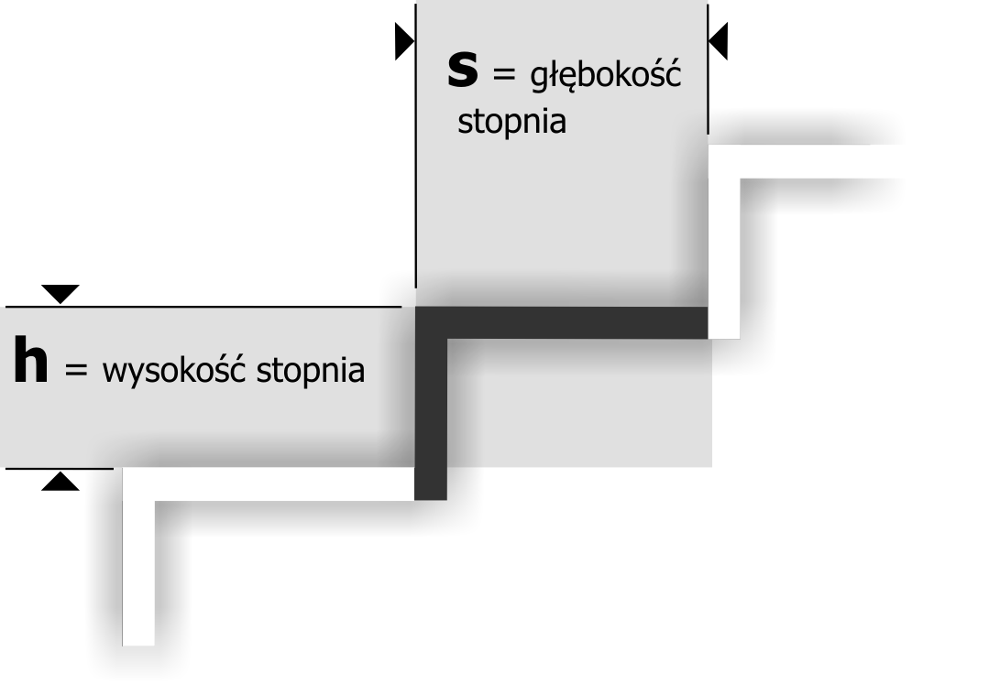

## Projekt Schody

## Wstęp
Program oblicza parametry schodów na podstawie podanych danych wejściowych zgodnie z zasadami techniki budowy i normami unijnymi. Omówiony zostanie kod programu, funkcjonalność zaimplementowanych funkcji oraz eksperyment pokazujący jego działanie. Wyniki obliczeń zostaną przedstawione w formie liczby stopni, ich wysokości oraz głębokości. Program przyjmuje jako dane wejściowe długość biegu schodów, wysokość kondygnacji i docelową wysokość stopnia, weryfikuje też wartości wyjściowe.

## Ilustracja poglądowa

## Kod kalkulatora
~~~~ cpp
#include <iostream>
#include <cmath>
#include <stdexcept>

class KalkulatorSchodow {
public:
    // Konstruktor przyjmujący długość biegu schodów i wysokość kondygnacji (w cm)
    KalkulatorSchodow(double dlugoscSchodow, double wysokoscPietra)
        : dlugoscSchodow(dlugoscSchodow), wysokoscPietra(wysokoscPietra) {}

    // Funkcja obliczająca liczbę stopni na podstawie docelowej wysokości stopnia
    int obliczLiczbeStopni(double wysokoscStopniaDocelowa) {
        if (wysokoscStopniaDocelowa < 17.0 || wysokoscStopniaDocelowa > 19.0) {
            throw std::invalid_argument("Wysokość stopnia musi być pomiędzy 17 a 19 cm.");
        }
        return static_cast<int>(std::round(wysokoscPietra / wysokoscStopniaDocelowa));
    }

    // Funkcja obliczająca rzeczywistą wysokość stopnia
    double obliczWysokoscStopnia(int iloscStopni) {
        if (iloscStopni <= 0) {
            throw std::invalid_argument("Liczba stopni musi być większa od zera.");
        }
        return wysokoscPietra / iloscStopni;
    }

    // Funkcja obliczająca rzeczywistą głębokość stopnia na podstawie liczby stopni i długości biegu
    double obliczGlebokoscStopnia(int iloscStopni) {
        if (iloscStopni <= 0) {
            throw std::invalid_argument("Liczba stopni musi być większa od zera.");
        }
        return dlugoscSchodow / iloscStopni;
    }

private:
    double dlugoscSchodow;       // Długość biegu schodów (w cm)
    double wysokoscPietra;       // Wysokość kondygnacji (w cm)
};
~~~~

## Kod funkcji main
~~~~ cpp

            
